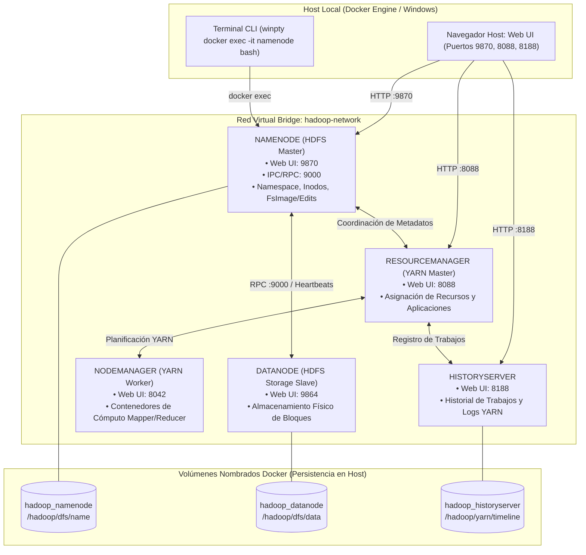

# INFORME DE INVESTIGACIÓN Y DESPLIEGUE (LG14)
## Despliegue y Validación de un Clúster Distribuido Apache Hadoop con HDFS y MapReduce en Docker

[](https://hadoop.apache.org/)
[](https://www.docker.com/)
[](https://www.univalle.edu/)
[]()
[]()

---

## 1. Portada y Registro Obligatorio del Repositorio

* **Institución:** Universidad Privada del Valle (Univalle)
* **Asignatura:** Tecnologías Emergentes / Big Data (Práctica LG14)
* **Grupo:** Grupo 4
* **Nombre de los estudiantes:** 
  * Joel Saavedra
  * Mauricio Linaja
  * Rommel Gutierrez
* **Nombre del repositorio oficial:** `bigdata-grupo-4`
* **Nombre del repositorio analizado:** `hadoop-hdfs-map-reduce-docker`
* **URL del repositorio analizado:** [https://github.com/MartinCastroAlvarez/hadoop-hdfs-map-reduce-docker](https://github.com/MartinCastroAlvarez/hadoop-hdfs-map-reduce-docker)
* **Autor / Organización:** Martin Castro Alvarez
* **Descripción en una línea:** Entorno Docker Compose para desplegar un clúster Apache Hadoop con NameNode, DataNode y procesamiento HDFS/MapReduce vía Hadoop Streaming.

---

## 2. Información General del Proyecto Analizado

| Campo | Especificación Técnica |
|---|---|
| **Nombre del Repositorio** | `hadoop-hdfs-map-reduce-docker` |
| **Autor u Organización** | Martin Castro Alvarez |
| **URL Oficial** | [https://github.com/MartinCastroAlvarez/hadoop-hdfs-map-reduce-docker](https://github.com/MartinCastroAlvarez/hadoop-hdfs-map-reduce-docker) |
| **Fecha de Creación** | Marzo de 2023 |
| **Última Actualización** | 2023 / 2024 |
| **Licencia** | MIT License |
| **Objetivo del Proyecto** | Proveer una infraestructura ligera, reproducible y contenerizada basada en Docker Compose para administrar almacenamiento masivo distribuido mediante **HDFS** y ejecutar tareas de procesamiento paralelo **MapReduce** mediante **Hadoop Streaming**. |

---

## 3. Tecnologías Utilizadas

* **Tecnología Big Data Principal:** Apache Hadoop (Módulos nativos **HDFS**, **YARN** y **MapReduce**).
* **Versión de Hadoop:** 3.2.1.
* **Motor de Contenedores:** Docker Engine 20.10+ / v24+ / v29+.
* **Orquestador:** Docker Compose (especificación compose v2 / v3.8).
* **Sistema Operativo Base:** Linux Debian Buster (OpenJDK 8 / Java 1.8.0_212).
* **Sistema de Almacenamiento Distribuido:** HDFS (*Hadoop Distributed File System*) con particionamiento y replicación de bloques.
* **Frameworks y Herramientas Adicionales:** Hadoop Streaming (`hadoop-streaming-3.2.1.jar`), Python 3, Curl, Bash / POSIX Shell.
* **Lenguajes Utilizados:** Java, Python, Shell Scripting (Bash).

---

## 4. Análisis de la Arquitectura del Sistema

### 4.1 Diagrama de Arquitectura del Clúster




---

## 5. Implementación Práctica Paso a Paso

### Paso 1: Levantar el Clúster
```bash
docker compose up -d
```

### Paso 2: Verificar el Estado de los Contenedores
```bash
docker ps
```
*(Validar que `namenode`, `datanode`, `resourcemanager`, `nodemanager` y `historyserver` figuren en estado `Up`).*

---

## 6. Pruebas Funcionales Obligatorias (Flujo Nativo en Terminal Linux del NameNode)

Ingresamos directamente a la consola Linux del NameNode:

```bash
winpty docker exec -it namenode bash
```
*(En PowerShell estándar o Linux: `docker exec -it namenode bash`)*

Una vez dentro de la terminal de Linux (`root@namenode:/#`), ejecutamos:

### 1. Creación de un Directorio en HDFS
```bash
hdfs dfs -mkdir -p /user/laboratorio
hdfs dfs -ls /user
```

### 2. Carga del Archivo de Prueba con los Nombres del Grupo
```bash
echo "Sistemas Distribuidos Big Data - Saavedra, Linaja, Gutierrez (Grupo 4)" > /tmp/prueba_hdfs.txt
hdfs dfs -put -f /tmp/prueba_hdfs.txt /user/laboratorio/
```

### 3. Consulta del Archivo Almacenado por Consola
```bash
hdfs dfs -ls /user/laboratorio
hdfs dfs -cat /user/laboratorio/prueba_hdfs.txt
```
*Salida obtenida:*
```text
Sistemas Distribuidos Big Data - Saavedra, Linaja, Gutierrez (Grupo 4)
```

### 4. Comprobación Gráfica (Web UI de HDFS)
1. Abrir en el navegador: [http://localhost:9870](http://localhost:9870)
2. Ir a: **Utilities** > **Browse the file system**.
3. Navegar a `/user/laboratorio/` y hacer clic en `prueba_hdfs.txt`.
4. Hacer clic en **Head the file (first 32K)** para previsualizar el contenido en vivo y verificar el **Block ID** (`1073741998`) asignado en el `datanode`.

---

## 7. Prueba de Procesamiento Distribuido MapReduce (Hadoop Streaming)

Dentro de la terminal de Linux del NameNode (`root@namenode:/#`), ejecutamos el trabajo distribuido MapReduce:

### 1. Preparación del Dataset en HDFS
```bash
hdfs dfs -mkdir -p /input_mr
echo -e "hadoop bigdata distributed hdfs\nhadoop mapreduce bigdata\nhdfs cluster saavedra linaja gutierrez grupo4" | hdfs dfs -put -f - /input_mr/data.txt
```

### 2. Limpieza de Salida Previa
```bash
hdfs dfs -rm -r -f /output_mr
```

### 3. Ejecución del Job MapReduce sobre YARN
```bash
hadoop jar /opt/hadoop-3.2.1/share/hadoop/tools/lib/hadoop-streaming-3.2.1.jar \
  -files /app/mapper.sh,/app/reducer.sh \
  -input /input_mr/data.txt \
  -output /output_mr \
  -mapper mapper.sh \
  -reducer reducer.sh
```

### 4. Consulta de Resultados Agregados en HDFS
```bash
hdfs dfs -cat /output_mr/part-00000
```
*Salida obtenida:*
```text
bigdata     2
cluster     1
distributed 1
grupo4      1
gutierrez   1
hadoop      2
hdfs        2
linaja      1
mapreduce   1
saavedra    1
```

Para salir de la consola del contenedor:
```bash
exit
```

---

## 8. Comparación Exhaustiva con `docker-hadoop` (Big Data Europe)

| Criterio Oficial | docker-hadoop (Big Data Europe) | hadoop-hdfs-map-reduce-docker (Martin Castro Alvarez) |
|---|---|---|
| **1. Tecnología Principal** | Apache Hadoop (HDFS + YARN) | Apache Hadoop (HDFS + MapReduce Streaming) |
| **2. Docker** | Sí (Imágenes Debian GNU/Linux) | Sí (Imágenes Debian Buster OpenJDK 8) |
| **3. Docker Compose** | Sí (Formato Compose v2 / v3) | Sí (Formato Compose v3 con orquestación modular) |
| **4. Número de Contenedores** | 5 contenedores estándar (`namenode`, `datanode`, `resourcemanager`, `nodemanager`, `historyserver`) | 5 contenedores especializados (`namenode`, `datanode`, `yarn`, `nodemanager`, `historyserver`) |
| **5. Almacenamiento Distribuido** | HDFS multi-nodo estándar con soporte para clústeres extendidos | HDFS modular con configuración ágil para laboratorios y pruebas |
| **6. Procesamiento Distribuido** | MapReduce clásico sobre YARN (JARs Java precompilados) | MapReduce mediante Hadoop Streaming y soporte para scripts en Python/Bash |
| **7. Interfaces Web** | NameNode (`9870`), YARN (`8088`), HistoryServer (`8188`), NodeManager (`8042`) | NameNode Web UI (`9870`), YARN Web UI (`8088`), History Web UI (`8188`) |
| **8. Persistencia** | Volúmenes Docker administrados montados en carpetas internas HDFS | Volúmenes nombrados montados en `/hadoop/dfs/name` y `/hadoop/dfs/data` |
| **9. Complejidad de Instalación** | Media-Alta (dependencia de archivo `.env` externo y variables globales) | Muy Baja (despliegue directo y autónomo con un único comando `docker compose up -d`) |
| **10. Documentación** | Enfocada en la infraestructura base del stack Big Data Europe | Práctica y enfocada en casos de uso, ejemplos de Streaming y pruebas funcionales |
| **11. Caso de Uso Principal** | Base de infraestructura para montar ecosistemas pesados (Hive, Presto, Spark) | Laboratorio ágil de aprendizaje, validación de HDFS y ejecución directa de algoritmos MapReduce |


