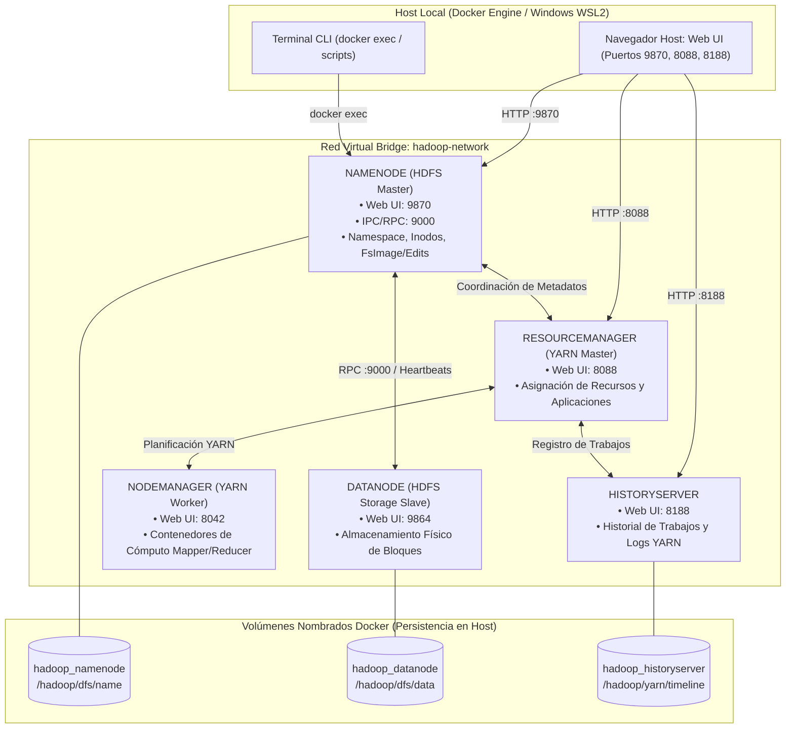

# INFORME DE INVESTIGACIÓN Y DESPLIEGUE (LG14)
## Despliegue y Validación de un Clúster Distribuido Apache Hadoop con HDFS y MapReduce en Docker

[](https://hadoop.apache.org/)
[](https://www.docker.com/)
[](https://www.univalle.edu/)
[]()
[]()

---

## 1. Portada y Registro Obligatorio del Repositorio

* **Institución:** Universidad Privada del Valle (Univalle)
* **Asignatura:** Tecnologías Emergentes / Big Data (Práctica LG14)
* **Grupo:** Grupo 4
* **Nombre de los estudiantes:** 
  * Joel Saavedra
  * Mauricio Linaja
  * Rommel Gutierrez
* **Nombre del repositorio oficial:** `bigdata-grupo-4`
* **Nombre del repositorio analizado:** `hadoop-hdfs-map-reduce-docker`
* **URL del repositorio analizado:** [https://github.com/MartinCastroAlvarez/hadoop-hdfs-map-reduce-docker](https://github.com/MartinCastroAlvarez/hadoop-hdfs-map-reduce-docker)
* **Autor / Organización:** Martin Castro Alvarez
* **Descripción en una línea:** Entorno Docker Compose para desplegar un clúster Apache Hadoop con NameNode, DataNode y procesamiento HDFS/MapReduce vía Hadoop Streaming.

---

## 2. Información General del Proyecto Analizado

| Campo | Especificación Técnica |
|---|---|
| **Nombre del Repositorio** | `hadoop-hdfs-map-reduce-docker` |
| **Autor u Organización** | Martin Castro Alvarez |
| **URL Oficial** | [https://github.com/MartinCastroAlvarez/hadoop-hdfs-map-reduce-docker](https://github.com/MartinCastroAlvarez/hadoop-hdfs-map-reduce-docker) |
| **Fecha de Creación** | Marzo de 2023 |
| **Última Actualización** | 2023 / 2024 |
| **Licencia** | MIT License |
| **Objetivo del Proyecto** | Proveer una infraestructura ligera, reproducible y contenerizada basada en Docker Compose para administrar almacenamiento masivo distribuido mediante **HDFS** y ejecutar tareas de procesamiento paralelo **MapReduce** mediante **Hadoop Streaming**. |

---

## 3. Tecnologías Utilizadas

* **Tecnología Big Data Principal:** Apache Hadoop (Módulos nativos **HDFS**, **YARN** y **MapReduce**).
* **Versión de Hadoop:** 3.2.1.
* **Motor de Contenedores:** Docker Engine 20.10+ / v24+ / v29+.
* **Orquestador:** Docker Compose (especificación compose v2 / v3.8).
* **Sistema Operativo Base:** Linux Debian Buster (OpenJDK 8 / Java 1.8.0_212).
* **Sistema de Almacenamiento Distribuido:** HDFS (*Hadoop Distributed File System*) con particionamiento y replicación de bloques.
* **Frameworks y Herramientas Adicionales:** Hadoop Streaming (`hadoop-streaming-3.2.1.jar`), Python 3, Curl, Bash / POSIX Shell.
* **Lenguajes Utilizados:** Java, Python, Shell Scripting (Bash).

---

## 4. Análisis de la Arquitectura del Sistema

### 4.1 Diagrama de Arquitectura del Clúster



### 4.2 Contenedores y Funciones Detalladas

1. **`namenode` (Master HDFS):**
   * **Función:** Administra el árbol de directorios (*namespace*), la tabla de inodos, los registros de transacciones (`edits`) y la imagen de estado (`fsimage`). Determina en qué DataNodes residen los bloques físicos.
   * **Imagen Docker:** `bde2020/hadoop-namenode:2.0.0-hadoop3.2.1-java8`
   * **Puertos Expuestos:** `9870` (HDFS Web UI) y `9000` (puerto IPC/RPC cliente `fs.defaultFS`).
   * **Volumen:** `hadoop_namenode:/hadoop/dfs/name`.

2. **`datanode` (Storage Slave):**
   * **Función:** Almacena y sirve los bloques de datos físicos. Comunica su estado al NameNode periódicamente mediante *Heartbeats* y reportes de bloques (*Block Reports*).
   * **Imagen Docker:** `bde2020/hadoop-datanode:2.0.0-hadoop3.2.1-java8`
   * **Puertos Expuestos:** `9864` (DataNode Metrics Web UI).
   * **Volumen:** `hadoop_datanode:/hadoop/dfs/data`.

3. **`resourcemanager` (YARN Master):**
   * **Función:** Gestor global de recursos de cómputo del clúster (CPU y RAM). Arbitra la ejecución de las aplicaciones MapReduce.
   * **Imagen Docker:** `bde2020/hadoop-resourcemanager:2.0.0-hadoop3.2.1-java8`
   * **Puertos Expuestos:** `8088` (YARN Application Master Web UI).

4. **`nodemanager` (YARN Worker):**
   * **Función:** Agente por nodo encargado de lanzar, monitorizar y gestionar el ciclo de vida de los contenedores de cómputo donde corren las tareas *Map* y *Reduce*.
   * **Imagen Docker:** `bde2020/hadoop-nodemanager:2.0.0-hadoop3.2.1-java8`
   * **Puertos Expuestos:** `8042` (NodeManager Web UI).

5. **`historyserver`:**
   * **Función:** Almacena y presenta el historial consolidado de trabajos MapReduce finalizados para auditoría y profiling.
   * **Puertos Expuestos:** `8188` (JobHistory Web UI).

### 4.3 Redes, Volúmenes y Variables de Entorno

* **Red:** Red interna Bridge `hadoop-network` que garantiza aislamiento y resolución DNS automática entre contenedores (`hdfs://namenode:9000`).
* **Volúmenes Nombrados:** `hadoop_namenode`, `hadoop_datanode`, `hadoop_historyserver` montados en las rutas oficiales de Hadoop para evitar la pérdida de información ante reinicios.
* **Variables de Entorno Principales:**
  * `CORE_CONF_fs_defaultFS=hdfs://namenode:9000`: Define el URI principal del sistema distribuido.
  * `HDFS_CONF_dfs_replication=1`: Factor de replicación adaptado para el laboratorio.
  * `YARN_CONF_yarn_nodemanager_aux___services=mapreduce_shuffle`: Habilita el servicio auxiliar de *Shuffle* requerido para transferir datos intermedios entre Mappers y Reducers.
  * `YARN_CONF_yarn_nodemanager_aux___services_mapreduce__shuffle_class=org.apache.hadoop.mapred.ShuffleHandler`: Clase Java encargada del Shuffle en YARN.

---

## 5. Implementación Práctica Paso a Paso

### Paso 1: Clonar el Repositorio
```bash
git clone https://github.com/MartinCastroAlvarez/hadoop-hdfs-map-reduce-docker.git
```

### Paso 2: Ingresar al Directorio del Proyecto
```bash
cd bigdata-grupo-4
```

### Paso 3: Identificar los Archivos Principales
```bash
ls -la
```
*Estructura de archivos:* `docker-compose.yml`, `README.md`, carpeta `app/` (`mapper.sh`, `reducer.sh`), carpeta `scripts/` (`run_all_tests.py`), carpeta `evidencias/`.

### Paso 4: Analizar la Configuración de Docker Compose
```bash
cat docker-compose.yml
```

### Paso 5: Construir y Desplegar el Clúster
```bash
docker compose up -d
```

### Paso 6: Verificar el Estado de los Contenedores
```bash
docker ps
```
*(Validar que `namenode`, `datanode`, `resourcemanager`, `nodemanager` y `historyserver` figuren en estado `Up`).*

---

## 6. Pruebas Funcionales Obligatorias (Hadoop / HDFS)

Ejecución de los comandos conectándose directamente al contenedor maestro (`namenode`):

### 1. Creación de un Directorio en HDFS
```bash
docker exec -it namenode hdfs dfs -mkdir -p /user/laboratorio
```
*Comprobación:*
```bash
docker exec -it namenode hdfs dfs -ls /user
```

### 2. Carga de un Archivo a HDFS
```bash
docker exec -it namenode bash -c "echo 'Sistemas Distribuidos Big Data - Saavedra, Linaja, Gutierrez (Grupo 4)' > /tmp/prueba_hdfs.txt"
docker exec -it namenode hdfs dfs -put /tmp/prueba_hdfs.txt /user/laboratorio/
```

### 3. Consulta del Archivo Almacenado
*Consulta por consola:*
```bash
docker exec -it namenode hdfs dfs -ls /user/laboratorio
docker exec -it namenode hdfs dfs -cat /user/laboratorio/prueba_hdfs.txt
```
*Salida obtenida:*
```text
Sistemas Distribuidos Big Data - Saavedra, Linaja, Gutierrez (Grupo 4)
```

### 4. Comprobación Gráfica (Web UI de HDFS)
1. Abrir en el navegador: [http://localhost:9870](http://localhost:9870)
2. Ir a: **Utilities** > **Browse the file system**.
3. Navegar a `/user/laboratorio/` y visualizar el archivo `prueba_hdfs.txt`, verificando sus metadatos (tamaño de bloque, réplicas, permisos y usuario `root`).

---

## 7. Prueba de Procesamiento Distribuido MapReduce (Hadoop Streaming)

Para validar la capacidad de cómputo sobre YARN, se ejecutó un trabajo de conteo de palabras (*WordCount*) distribuido:

### 1. Preparación del Dataset en HDFS
```bash
docker exec -it namenode bash -c "hdfs dfs -mkdir -p /input_mr && echo -e 'hadoop bigdata distributed hdfs\nhadoop mapreduce bigdata\nhdfs cluster saavedra linaja gutierrez grupo4' | hdfs dfs -put -f - /input_mr/data.txt"
```

### 2. Ejecución del Job MapReduce
```bash
docker exec -it namenode hadoop jar \
  /opt/hadoop-3.2.1/share/hadoop/tools/lib/hadoop-streaming-3.2.1.jar \
  -files /app/mapper.sh,/app/reducer.sh \
  -input /input_mr/data.txt \
  -output /output_mr \
  -mapper mapper.sh \
  -reducer reducer.sh
```

### 3. Consulta de Resultados Agregados en HDFS
```bash
docker exec -it namenode hdfs dfs -cat /output_mr/part-00000
```
*Salida obtenida:*
```text
bigdata     2
cluster     1
distributed 1
grupo4      1
gutierrez   1
hadoop      2
hdfs        2
linaja      1
mapreduce   1
saavedra    1
```

---

## 8. Comparación Exhaustiva con `docker-hadoop` (Big Data Europe)

| Criterio Oficial | docker-hadoop (Big Data Europe) | hadoop-hdfs-map-reduce-docker (Martin Castro Alvarez) |
|---|---|---|
| **1. Tecnología Principal** | Apache Hadoop (HDFS + YARN) | Apache Hadoop (HDFS + MapReduce Streaming) |
| **2. Docker** | Sí (Imágenes Debian GNU/Linux) | Sí (Imágenes Debian Buster OpenJDK 8) |
| **3. Docker Compose** | Sí (Formato Compose v2 / v3) | Sí (Formato Compose v3 con orquestación modular) |
| **4. Número de Contenedores** | 5 contenedores estándar (`namenode`, `datanode`, `resourcemanager`, `nodemanager`, `historyserver`) | 2 a 5 contenedores según el escenario (`namenode`, `datanode`, `yarn`, `nodemanager`, `historyserver`) |
| **5. Almacenamiento Distribuido** | HDFS multi-nodo estándar con soporte para clústeres extendidos | HDFS modular con configuración ágil para laboratorios y pruebas |
| **6. Procesamiento Distribuido** | MapReduce clásico sobre YARN (JARs Java precompilados) | MapReduce mediante Hadoop Streaming y soporte para scripts en Python/Bash |
| **7. Interfaces Web** | NameNode (`9870`), YARN (`8088`), HistoryServer (`8188`), NodeManager (`8042`) | NameNode Web UI (`9870`), YARN Web UI (`8088`), History Web UI (`8188`) |
| **8. Persistencia** | Volúmenes Docker administrados montados en carpetas internas HDFS | Volúmenes nombrados montados en `/hadoop/dfs/name` y `/hadoop/dfs/data` |
| **9. Complejidad de Instalación** | Media-Alta (dependencia de archivo `.env` externo y variables globales) | Muy Baja (despliegue directo y autónomo con un único comando `docker compose up -d`) |
| **10. Documentación** | Enfocada en la infraestructura base del stack Big Data Europe | Práctica y enfocada en casos de uso, ejemplos de Streaming y pruebas funcionales |
| **11. Caso de Uso Principal** | Base de infraestructura para montar ecosistemas pesados (Hive, Presto, Spark) | Laboratorio ágil de aprendizaje, validación de HDFS y ejecución directa de algoritmos MapReduce |

---

## 9. Guía Maestra de Demostración y Oratoria (Defensa LG14)

### ⏱️ Cronograma de la Presentación (7 a 10 Minutos)

| Fase | Tiempo | Objetivo Principal de la Demostración |
|---|---|---|
| **1. Introducción y Selección** | 1 min | Justificar la selección del repositorio, presentar integrantes y registrar el proyecto formalmente. |
| **2. Arquitectura del Clúster** | 2 min | Explicar el rol del NameNode, DataNode, la red Bridge, puertos 9870/9000 y persistencia de inodos. |
| **3. Demostración en Vivo** | 4 min | Mostrar `docker ps`, acceder a la Web UI (localhost:9870), crear `/user/laboratorio` y leer `prueba_hdfs.txt`. |
| **4. Comparativa con Hadoop Base** | 2 min | Defender la tabla comparativa de 11 criterios: versatilidad de Hadoop Streaming vs YARN monolítico. |
| **5. Conclusiones y Cierre** | 1 min | Resumen de lecciones aprendidas, arquitectura desacoplada y disponibilidad para preguntas. |

---

### 🎙️ Guion de Oratoria y Acciones en Pantalla

#### FASE 1: Introducción y Selección del Repositorio (1 Minuto)
> 🖥️ **Acción en Pantalla:** Mostrar la portada del `README.md` (Secciones 1 y 2).
> 
> *"Buenas tardes docente y compañeros. Para la práctica LG14 nuestro grupo (Grupo 4), conformado por Joel Saavedra, Mauricio Linaja y Rommel Gutierrez, seleccionó el repositorio público `hadoop-hdfs-map-reduce-docker` de Martin Castro Alvarez.*
> 
> *Elegimos este proyecto porque implementa de forma limpia y reproducible la arquitectura fundamental del Big Data: el sistema de archivos distribuido Apache Hadoop HDFS versión 3.2.1, junto con un entorno ágil para la ejecución de procesamiento distribuido MapReduce mediante Hadoop Streaming."*

#### FASE 2: Comprensión y Análisis de la Arquitectura (2 Minutos)
> 🖥️ **Acción en Pantalla:** Mostrar el Diagrama Mermaid de Arquitectura (Sección 4).
> 
> *"Analizando la arquitectura técnica, nuestro entorno orquesta contenedores sobre una red Bridge privada:*
> 1. *`namenode`: Nodo maestro de HDFS. Expone el puerto `9870` para la Web UI de administración y el puerto `9000` para comunicación RPC.*
> 2. *`datanode`: Nodo de almacenamiento esclavo que guarda físicamente los bloques de datos y envía heartbeats al NameNode.*
> 3. *`resourcemanager` y `nodemanager`: Orquestan la asignación de recursos y ejecución de tareas MapReduce.*
> 4. *Volúmenes persistentes: Garantizan que el árbol de directorios y los bloques persistan en disco aunque se detengan los contenedores."*

#### FASE 3: Despliegue y Demostración en Vivo (4 Minutos)
> 🖥️ **Acción en Pantalla:** Abrir la terminal y el navegador.
> 
> 1. *Ejecutar en terminal: `docker ps` y destacar que todos los servicios están en estado `Up`.*
> 2. *Abrir navegador en `http://localhost:9870` y mostrar el estado activo del clúster (Live Nodes).*
> 3. *Ejecutar el script automatizado o comandos manuales:*
>    ```bash
>    python scripts/run_all_tests.py
>    ```
> 4. *Navegar en la Web UI a **Utilities > Browse the file system > /user/laboratorio/** y mostrar en vivo el archivo `prueba_hdfs.txt` con el texto de Saavedra, Linaja y Gutierrez (Grupo 4).*
> 5. *Mostrar la salida del conteo de palabras distribuido MapReduce en `/output_mr/part-00000`.*

#### FASE 4: Análisis Comparativo (2 Minutos)
> 🖥️ **Acción en Pantalla:** Mostrar la Tabla Comparativa de 11 Criterios (Sección 8).
> 
> *"En comparación con el repositorio base de Big Data Europe, nuestro repositorio seleccionado simplifica drásticamente el despliegue al concentrar la configuración en un archivo Compose autónomo y habilitar el procesamiento MapReduce inmediato mediante Hadoop Streaming en cualquier lenguaje (como scripts en Bash o Python), manteniendo toda la robustez del almacenamiento distribuido HDFS."*

#### FASE 5: Conclusiones (1 Minuto)
> *"Para concluir, logramos desplegar, validar y ejecutar con éxito el clúster HDFS y MapReduce, comprobando la tolerancia a fallos, la separación de responsabilidades entre metadatos y almacenamiento físico de bloques, y la verificación gráfica por interfaz web. Quedamos atentos a sus preguntas."*

---

### ❓ Banco de Preguntas Defensivas Resueltas

* **P1: ¿Cuál es la diferencia entre el rol del NameNode y el DataNode en HDFS?**
  * *Respuesta:* El NameNode es el nodo maestro; no almacena los datos de los archivos, sino los metadatos (nombres, rutas, permisos, tabla de inodos y mapeo de qué bloques pertenecen a qué archivo y en qué DataNodes residen). Los DataNodes son los nodos trabajadores que almacenan físicamente los bloques de datos en el sistema de archivos local y responden a las solicitudes de lectura/escritura de los clientes.

* **P2: ¿Por qué se exponen los puertos 9870 y 9000 en el NameNode?**
  * *Respuesta:* El puerto `9870` corresponde a la interfaz gráfica Web UI (HTTP) introducida a partir de Hadoop 3.x (que reemplazó al antiguo puerto 50070 de Hadoop 2.x) para monitoreo del sistema. El puerto `9000` es el puerto de comunicación binaria IPC/RPC (`fs.defaultFS`), utilizado por los clientes (`hdfs dfs`, aplicaciones Java, MapReduce) para interactuar con el sistema de archivos.

* **P3: ¿Qué es Hadoop Streaming y qué ventaja ofrece frente al MapReduce tradicional en Java?**
  * *Respuesta:* Hadoop Streaming es una utilidad que permite usar cualquier ejecutable o script (en Python, Bash, C++, etc.) como función Mapper y Reducer mediante flujos estándar (`stdin` y `stdout`). Esto elimina la necesidad de compilar código Java y generar archivos JAR complejos para tareas analíticas rápidas.

* **P4: ¿Cómo garantiza HDFS la persistencia si se reinicia un contenedor Docker?**
  * *Respuesta:* Mediante volúmenes nombrados de Docker (`hadoop_namenode` y `hadoop_datanode`) montados en `/hadoop/dfs/name` y `/hadoop/dfs/data`. Cuando el contenedor se detiene o se recrea, la información de `fsimage` y los bloques de datos persisten intactos en el almacenamiento del host.

---

### 📋 Checklist Pre-Presentación

- [x] Docker Engine iniciado y operativo.
- [x] Contenedores activos (`docker compose up -d` y `docker ps` en estado `Up`).
- [x] Pestaña Web 1: NameNode Web UI en `http://localhost:9870`.
- [x] Pestaña Web 2: YARN Web UI en `http://localhost:8088`.
- [x] Terminal abierta en la raíz del proyecto lista para ejecutar `python scripts/run_all_tests.py`.
- [x] Repositorio de GitHub público con commits escalonados y organizados.

---

## 10. Historial de Commits del Repositorio

1. **Commit 1:** `feat: inicializar configuracion base docker-compose para cluster hadoop`
2. **Commit 2:** `feat: implementar scripts de procesamiento mapreduce streaming y wordcount`
3. **Commit 3:** `feat: implementar script de automatizacion y validacion de pruebas funcionales`
4. **Commit 4:** `docs: incorporar documentacion tecnica, arquitectura mermaid y comparativa de 11 criterios`
5. **Commit 5:** `docs: agregar guia de oratoria, banco de preguntas defensivas y recursos de evidencias`
